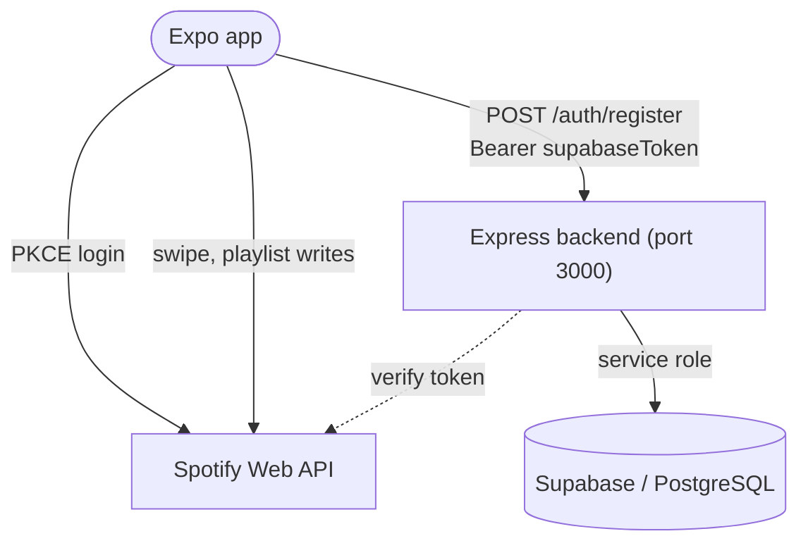

# 🎧 MusicSwipe

[](app.json)
[](package.json)
[](tsconfig.json)
[](app)
[](src/stores)
[](backend/package.json)
[](backend/src/db/schema.sql)
[](package.json)

A React Native (Expo) app that lets a user swipe through a Spotify playlist Tinder-style while
each track plays live. Liked and super-liked tracks land in one or more destination playlists.

The mobile app talks to Spotify only through a single adapter boundary
(`src/adapters/spotify/`), so no other file in the codebase contains a Spotify-specific string
or type. A small Express + Supabase backend handles the OAuth handoff, swipe history, and session
resume — everything else about "does the track get added to the right playlist" happens
client-side against the Spotify Web API.

## 📑 Table of Contents

- [🏗️ Architecture](#-architecture)
- [💻 Local Development](#-local-development)
- [⚙️ Configuration](#-configuration)
- [🔌 API](#-api)
- [🗄️ Data Model](#-data-model)
- [🧪 Testing](#-testing)
- [📦 Production Builds](#-production-builds)
- [📁 Repo Layout](#-repo-layout)
- [👤 Author](#-author)

## 🏗️ Architecture



- **Adapter boundary** (`src/adapters/spotify/`) is the only place that talks to Spotify. UI and
  business logic call a `MusicPlatformAdapter` interface instead, so a second platform could be
  added without touching the swipe, player, or playlist code.
- **`useSpotifyAuth`** (`src/auth/useSpotifyAuth.ts`) runs the OAuth PKCE flow with
  `expo-auth-session` directly against Spotify — the client secret is never needed on-device.
- **Express backend** (`backend/src/index.ts`, port from `PORT`, default `3000`) exposes
  `/auth`, `/users`, `/sessions`, and `/swipes`. It verifies the Spotify access token, derives a
  deterministic Supabase user, and returns a Supabase JWT the app sends as a Bearer token on
  every other call.
- **Supabase / PostgreSQL** (`backend/src/db/schema.sql`) stores users, cached playlists and
  tracks, swipe sessions, and individual swipes. The `upsert_swipes` function batches swipe
  writes and reconciles stale `pending` rows in one transaction.
- **Zustand stores** (`src/stores/`) hold local swipe and session state. A swipe is recorded
  locally first, then synced to the backend fire-and-forget — local state always wins.

## 💻 Local Development

**Prerequisites**: Node.js, the [Expo CLI](https://docs.expo.dev/get-started/installation/)
(`npm install -g expo`), a Spotify Developer app, and a Supabase project.

1. Install dependencies for both the app and the backend:
   ```bash
   npm install
   cd backend && npm install && cd ..
   ```
2. Create `.env.local` in the project root for the mobile app:
   ```
   EXPO_PUBLIC_SPOTIFY_CLIENT_ID=<your-spotify-client-id>
   EXPO_PUBLIC_BACKEND_URL=http://localhost:3000
   ```
3. Create `backend/.env` for the server:
   ```
   SUPABASE_URL=<your-supabase-project-url>
   SUPABASE_SERVICE_ROLE_KEY=<your-supabase-service-role-key>
   ```
4. Initialize the database — run `backend/src/db/schema.sql` against your Supabase project's
   SQL editor or `psql`.
5. Start the backend:
   ```bash
   cd backend && npm run dev
   ```
6. In a separate terminal, start the mobile dev server:
   ```bash
   npx expo start
   ```
   Scan the QR code with Expo Go, or press `i` for the iOS simulator / `a` for the Android
   emulator.

**Tests**: `npx jest` (mobile app, from the repo root) and `cd backend && npm test` (backend).

## ⚙️ Configuration

### Mobile (`.env.local`)

| Variable | Required | Default | Purpose |
|---|---|---|---|
| `EXPO_PUBLIC_SPOTIFY_CLIENT_ID` | yes | — | Spotify app client ID, used directly in the PKCE flow. |
| `EXPO_PUBLIC_BACKEND_URL` | no | `http://localhost:3000` | Base URL of the Express backend (`src/config.ts`). |

### Backend (`backend/.env`)

| Variable | Required | Default | Purpose |
|---|---|---|---|
| `SUPABASE_URL` | yes | — | Supabase project URL. The process throws at import time if unset. |
| `SUPABASE_SERVICE_ROLE_KEY` | yes | — | Service role key. Also used to derive each user's internal Supabase password via HKDF. |
| `PORT` | no | `3000` | Express listen port. |
| `ALLOWED_ORIGINS` | no | `http://localhost:3000,http://localhost:19000` | Comma-separated CORS allowlist. |
| `RATE_LIMIT_WINDOW_MS` | no | see `middleware/rateLimit.ts` | Global rate-limit window. |
| `RATE_LIMIT_MAX` | no | see `middleware/rateLimit.ts` | Global rate-limit request cap per window. |

There is no Spotify client secret on the backend — the app authenticates against Spotify
directly with PKCE, and the backend only verifies the resulting access token against
`GET https://api.spotify.com/v1/me`.

## 🔌 API

All routes below `/sessions`, `/users`, and `/swipes` require `Authorization: Bearer <supabaseToken>`.

| Method | Path | Body / Query | Returns |
|---|---|---|---|
| `POST` | `/auth/register` | `{ spotifyAccessToken }` | `{ supabaseToken, userId }` |
| `GET` | `/users/me` | — | The authenticated user's profile row. |
| `POST` | `/sessions` | `{ sourcePlaylistId, sourcePlaylistName?, destinationPlaylistIds?, destinationPlaylistNames?, isFilterMode?, totalTracks? }` | `201 { id }` |
| `PATCH` | `/sessions/:id` | `{ endedAt?, resumeOffset?, status?, ... }` | `{ ok: true }`, `404` if not owned |
| `GET` | `/sessions` | — | `{ sessions }` — up to 50 most recent, with live swipe counts |
| `GET` | `/sessions/:id` | — | The session plus swipe stats, `404` if not owned |
| `POST` | `/swipes` | `{ swipes: SwipeInput[] }` | `{ inserted, updated }` — batched upsert |
| `GET` | `/swipes` | `status?, source_playlist_id?, session_id?` | `{ swipes }` |

## 🗄️ Data Model

`backend/src/db/schema.sql` defines five tables: `users`, `playlists`, `tracks`, `sessions`, and
`swipes` (plus `swipe_destinations` for the many-to-many between a swipe and the playlists it
was written to). The `upsert_swipes` Postgres function batches a session's swipes, upserts track
metadata, and reconciles dangling `pending` rows in one transaction — see the comment block
above its definition for the full contract. Four migrations in `backend/src/db/migrations/` are
already folded into `schema.sql`; a fresh database built from `schema.sql` alone matches one
built by applying them in order.

## 🧪 Testing

```bash
npx jest                                    # mobile app — all tests
npx jest --testPathPattern="SwipeEngine"    # mobile app — a single test file
cd backend && npm test                      # backend
```

The mobile suite uses `MockAdapter` (`src/adapters/mock/`), a fixture-based implementation of
`MusicPlatformAdapter`, so no Spotify credentials are needed to run it.

## 📦 Production Builds

```bash
eas build --platform ios
eas build --platform android
```

Build profiles are in `eas.json`: `development` builds a simulator/APK build against
`localhost:3000`, `preview` builds an internal APK against `https://api.musicswipe.app`, and
`production` targets the App Store and Play Store with auto-incrementing build numbers.

## 📁 Repo Layout

```
app/                        Expo Router routes (file-based)
  (auth)/                   login screen
  (tabs)/                   swipe, matches, destination picker, settings, session-end
src/
  adapters/                 MusicPlatformAdapter interface, Spotify implementation, mock for tests
  auth/                     Spotify OAuth PKCE (useSpotifyAuth) and AuthGateway
  swipe/                    card stack, gesture handling, like/skip/super-like
  player/                   track playback and ±20s seek via the adapter
  playlist/                 playlist fetching and pagination
  services/                 PlaylistWriter, BackendSync, SessionTracker
  deeplink/                 opens the Spotify app when no active device is found
  matches/                  server-fetched liked tracks
  stores/                   Zustand state
  components/               shared UI
  config.ts                 BACKEND_URL — the single source of truth for the backend base URL
backend/
  src/routes/                auth, users, sessions, swipes
  src/middleware/             requireAuth, rate limiting
  src/db/schema.sql           tables + the upsert_swipes function
  src/db/migrations/          historical migrations, folded into schema.sql
docs/                        ARCHITECTURE.md, PLAN.md, TODO.md, dated code reviews
eslint-rules/                custom ESLint rules enforcing the adapter boundary
```

## 👤 Author

**Yarin Solomon** — Full Stack Developer

- Email: [yarinso39@gmail.com](mailto:yarinso39@gmail.com)
- GitHub: [github.com/yarins0](https://github.com/yarins0)
- LinkedIn: [linkedin.com/in/yarin-solomon](https://www.linkedin.com/in/yarin-solomon/)
- Portfolio: [yarin-lab](https://yarin-lab.vercel.app/)
